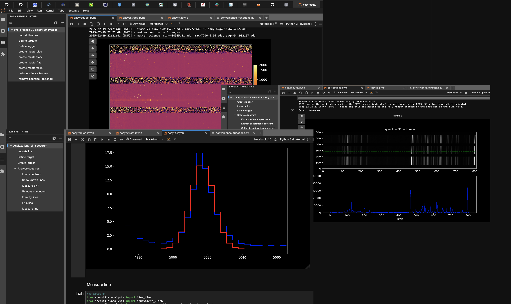

# EasyAstro : a set of spectroscopy python-based notebooks for amateurs:
- easyviewer : generic FIT images viewer (USABLE)
- easyreduce : images preprocessing (USABLE)
- easyextract : long-slit spectrum extract and calibrate (USABLE)
- easyfit : long-slit spectrum analysis (USABLE) 
- easyplan : display info, field-of-view, altitude of target (USABLE)

# Installation:
- install miniforge3 : https://github.com/conda-forge/miniforge 
- create (or reuse your base env) a python environment : $ conda env update --file environment.yml
- install required packages :  $ pip install -r requirements.txt
- start jupyter lab (or notebook) : $ jupyter lab
- open a notebook...
  
# References : 
- astropy workshop from https://github.com/astropy/astropy-workshop
- JWST data exploration : https://jwst-docs.stsci.edu/jwst-post-pipeline-data-analysis/data-analysis-example-jupyter-notebooks
- python cookbook from https://github.com/ipython-books/cookbook-2nd
- code snippets from https://prancer.physics.louisville.edu/classes/650/python/examples/
- astro-datalab from https://datalab.noirlab.edu
